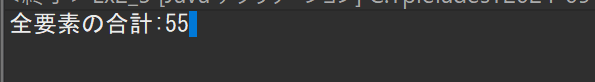
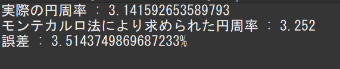
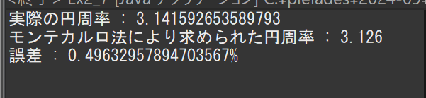
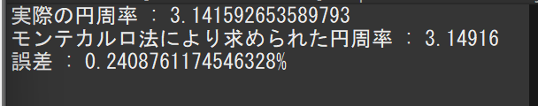

# プログラミング演習II 第2回
* 学籍番号：2364170
* 氏名：土戸海人
* 所属：情報工学EP

# 課題の説明

## 課題1(Ex2_5)
ソースファイル:Ex2_5.java

### プログラムの説明
* int型の配列を宣言し、初期値を設定し、全要素の値の合計を求めて表示した。

### 実行結果

### 考察
*　配列の宣言のやり方はc言語と異なるが、初期値の設定や要素の計算方法はc言語と似ている。

## 課題2(Ex2_6)
ソースファイル:Ex2_6.java

### プログラムの説明
* 三次元ベクトルを格納するためのdouble型の配列を宣言し、要素に数値を代入した後に、そのベクトルの大きさを求め表示した。

### 実行結果

### 考察
* 平方根の計算の仕方が、c言語は標準ライブラリ(math.h)をインクルードした後にsqrt関数を使用したが、javaはMath.sqrt(x)と書くだけで簡単にsqrt関数を利用できる。

## 課題3(Ex2_7)
ソースファイル:Ex2_7.java

### プログラムの説明
* モンテカルロ法を用いて半径1の円の面積を求め、面積からπの値を算出した。
* 求めたπの値とMathクラスの静的変数であるπの値を比較し、誤差を求め、表示した。
* 乱数の数を1000 → 10000 → 100000とふやして算出されるπの値の変化を確認した。

### 実行結果

* 乱数の数が1000の時の実行結果
  

* 乱数の数が10000の時の実行結果

*乱数の数が100000の時の実行結果

### 考察
* 乱数の数を増やすほどに、算出される円周率の正確さが増すことが分かった。

## 課題4(Ex2_8)
ソースファイル:Ex2_8.java

### プログラムの説明
* for文を用いて正数1－10までの和と二乗和を求めて表示した。
* Debug機能を用いてブレークポイントを設定し、変数の値を逐一確認した。

### 実行結果

### 考察
* Debug機能を用いると、ループの中身などの分かりにくい箇所の動作を中断しつつ確認できるため、エラー箇所の発見に活用できそうだと思った。

# 参考文献
* 演習のwebサイト
* [初心者必見] Eclipse(java)のまず覚えておきたいデバッグ機能の使い方
  https://zenn.dev/codek2/articles/1e0a2bed8e2163

# 謝辞
* 友人である岩崎みつひろ君に、モンテカルロ法の概要を教えてもらった。

# 感想など
* 今のところ、基礎的な部分においてjavaはc言語と結構似ているため、理解しやすかった。これから学んでいくにつれて、c言語との相違点がたくさん出てきて苦労すると思うので、頑張っていきたい。
